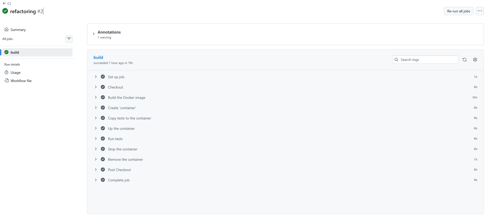

## Отчет по лабораторной работе №8: Непрерывная интеграция с помощью Github Actions

### Цель работы: Научиться настраивать непрерывную интеграцию (CI) с помощью Github Actions для автоматизации сборки и тестирования проекта.

### Задание: Создать Web приложение, написать тесты для него и настроить непрерывную интеграцию с помощью Github Actions на базе контейнеров.

### Выполнение задания: 

### 1. Создание Web приложения

Создаю репозиторий `containers08` и клонирую к себе на компьютер.

Создаю структуру проекта:

```containers08/
├── .github/
│   └── workflows/
├── site/
│   └── modules/
│   │   └── database.php
│   │   └── page.php
│   └── styles/
│   │   └── style.css
│   └── templates/
│   │   └── index.tpl
│   └── config.php
│   └── index.php
├── sql/
│   └── schema.sql
├── tests/
│   └── testframework.php
│   └── tests.php
├── Dockerfile
```

Файл `modules/database.php` содержит класс `Database` для работы с базой данных. Для работы с базой данных используется `SQLite`. Класс содержит методы:

- `__construct($path)` - конструктор класса, принимает путь к файлу базы данных SQLite;
- `Execute($sql)` - выполняет SQL запрос;
- `Fetch($sql)` - выполняет SQL запрос и возвращает результат в виде ассоциативного массива.
- `Create($table, $data)` - создает запись в таблице ```$table``` с данными из ассоциативного массива ```$data``` и возвращает идентификатор созданной записи;
- `Read($table, $id)` - возвращает запись из таблицы ```$table``` по идентификатору ```$id```;
- `Update($table, $id, $data)` - обновляет запись в таблице ```$table``` по идентификатору ```$id``` данными из ассоциативного массива $data;
- `Delete($table, $id)` - удаляет запись из таблицы ```$table``` по идентификатору ```$id```.
- `Count($table)` - возвращает количество записей в таблице ```$table```.

Файл `modules/page.php` содержит класс Page для работы со страницами. Класс содержит методы `__construct($template)` и `Render($data)`:

```php
public function __construct($template)
{
$this->template = $template;
}
```

```php
public function Render($data)
    {
        if (!file_exists($this->template)) {
            die("Template file not found.");
        }

        $content = file_get_contents($this->template);

        foreach ($data as $key => $value) {
            $content = str_replace('{{' . $key . '}}', htmlspecialchars((string)$value), $content);
        }

        return $content;
    }
}
```

Файл `templates/index.tpl` содержит шаблон страницы.

Файл `styles/style.css` содержит стили для страницы.

Файл `index.php` содержит код для отображения страницы.

Файл `config.php` содержит настройки для подключения к базе данных:

```php
$config = [
    "db" => [
        "path" => __DIR__ . "/database.sqlite"
    ]
];
```

### 2. Подготовка SQL файла для базы данных

В директории `./sql` в файле `schema.sql` создаю таблицу `pages` для хранения страниц:

```sql
CREATE TABLE page (
    id INTEGER PRIMARY KEY AUTOINCREMENT,
    title TEXT,
    content TEXT
);

INSERT INTO page (title, content) VALUES ('Page 1', 'Content 1');
INSERT INTO page (title, content) VALUES ('Page 2', 'Content 2');
INSERT INTO page (title, content) VALUES ('Page 3', 'Content 3');
```

### 3. Написание тестов

В директории `./tests` создаю файл `testframework.php` с простым тестовым фреймворком:

Этот класс позволяет запускать тесты и выводить результаты в консоль. Он содержит методы:
- `add` - добавляет тест в список тестов;
- `run` - запускает все добавленные тесты и выводит результаты.
- `getResults` - возвращает массив с результатами тестов.

Далее создаю файл `tests.php` с тестами для класса Database:

В файле прописываю функции, которые проверяют следующие сценарии:

- `testDbConnection` - проверяет возможность подключения к базе данных;
- `testDbCreate` - проверяет создание записи в таблице;
- `testDbRead` - проверяет чтение записи из таблицы;
- `testDbUpdate` - проверяет обновление записи в таблице;
- `testDelete` - проверяет удаление записи из таблицы;
- `testDbFetch` - проверяет выполнение SQL запроса и получение результата в виде ассоциативного массива;
- `testPageRender` - проверяет класс для работы с шаблонами.

Функции регистрируются, запускаются и выводят результаты в консоль.

### 4. Создание Dockerfile

Создаю файл `Dockerfile` для сборки образа с нашим приложением и тестами:

```dockerfile
FROM php:7.4-fpm as base

RUN apt-get update && \
    apt-get install -y sqlite3 libsqlite3-dev && \
    docker-php-ext-install pdo_sqlite

VOLUME ["/var/www/db"]

COPY sql/schema.sql /var/www/db/schema.sql

RUN echo "prepare database" && \
    cat /var/www/db/schema.sql | sqlite3 /var/www/db/db.sqlite && \
    chmod 777 /var/www/db/db.sqlite && \
    rm -rf /var/www/db/schema.sql && \
    echo "database is ready"

COPY site /var/www/html
```

### 5. Настройка Github Actions

Создаю файл `.github/workflows/main.yml` для настройки непрерывной интеграции:

```yaml
name: CI

on:
  push:
    branches:
      - main

jobs:
  build:
    runs-on: ubuntu-latest
    steps:
      - name: Checkout
        uses: actions/checkout@v4
      - name: Build the Docker image
        run: docker build -t containers08 .
      - name: Create `container`
        run: docker create --name container --volume database:/var/www/db containers08
      - name: Copy tests to the container
        run: docker cp ./tests container:/var/www/html
      - name: Up the container
        run: docker start container
      - name: Run tests
        run: docker exec container php /var/www/html/tests/tests.php
      - name: Stop the container
        run: docker stop container
      - name: Remove the container
        run: docker rm container
```

Каждый раз при пуше в ветку `main` будет выполняться сборка Docker образа, создание контейнера, копирование тестов, запуск контейнера, выполнение тестов внутри контейнера и последующая остановка и удаление контейнера.
Благодаря этому процессу мы можем быть уверены, что наше приложение работает корректно при каждом изменении кода.

### 6. Запуск и Тестирование 

Отправляю изменения в репозиторий и наблюдаю за выполнением Github Actions. Все тесты проходят успешно, что подтверждает корректность работы приложения и его компонентов.



### Контрольные вопросы 

**1. Что такое непрерывная интеграция?**

Непрерывная интеграция - это практика, когда все изменения, которые вносятся в код, автоматически проверяются и тестируются, после того, как мы отправляем их в репозиторий. Это позволяет быстро обнаруживать и исправлять ошибки, а также поддерживать высокое качество кода.

**2. Для чего нужны юнит-тесты? Как часто их запускать?**

Юнит-тесты - это тесты, которые проверяют отдельные части кода (например, функции или методы) в изоляции от всего остального на правильность их работы. Они помогают убедиться, что каждая часть кода работает так, как задумано. Юнит-тесты следует запускать при каждом изменении кода, чтобы быстро обнаруживать и исправлять ошибки.

**3. Как запускать тесты при создании Pull Request?**

Для запуска тестов при создании Pull Request можно настроить Github Actions так, чтобы он выполнялся не только при пуше в ветку `main`, но и при открытии Pull Request. Для этого нужно изменить триггер в файле `.github/workflows/main.yml` следующим образом:

```yaml
on:
  push:
    branches:
      - main
  pull_request:         # Добавляем эту строку
    branches:           # И указываем ветку, в которую направлен запрос
      - main
```

Теперь, как только кто-то захочет влить свой код в main, GitHub сначала запустит тесты и покажет результат прямо в окне запроса.

**4. Как удалять созданные Docker-образы после тестов?**

Для удаления созданных Docker-образов после тестов можно добавить шаг в Github Actions, который будет удалять образ после выполнения тестов. Например, можно добавить следующий шаг в файл `.github/workflows/main.yml`:

```yaml
      - name: Remove the Docker image
        run: docker rmi containers08
```

### Вывод

В данной лабораторной работе были изучены основы настройки непрерывной интеграцию с помощью Github Actions для автоматизации сборки и тестирования проекта. Было создано простое Web приложение, написаны тесты для него и настроено CI, что позволяет быть уверенным в корректности работы приложения при каждом изменении кода. 